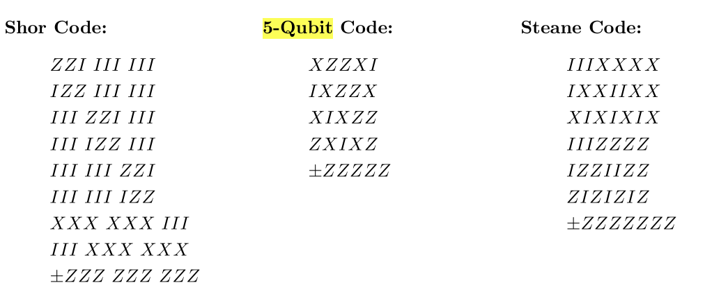

用于量子系统设计的几种常用的纠错码, 及相关性质.

## From Stabilizer Code to CSS Code

**Def. (CSS Code)** 若某个stabilizer code, 其生成元要么都是$I$和$X$，要么都是$I$和$Z$, 则称其为CSS code.

**Remark.** CSS code是stabilizer code的子集.

**Remark.** Shor code和Steane code是CSS code. 而下图中的5-qubit code不是CSS code.

> [!NOTE]
>
> 这个5-qubit code是: **最小的**可以检测(detect) 并纠正 (correct) 任意单个比特上错误的code.

> [!NOTE]
>
> 生成元可以看作校验矩阵中的行，生成元构成的**稳定子群**（stabilizer group），就“校验”出来了码空间（code space）。

CSS code可以由两个对偶 (dual) 的classical error correction code来组成. (这是Gottesman讲义中引入CSS的方法, 但不直接)

我们为什么喜欢CSS code呢? 因其支持一些transversal gate.

**Def. (Transversal Gate, informal)** 若逻辑门$G_L$ = 对每个物理比特作相同的物理门$G$, 则称其为transversal的.

**Remark.** 考虑硬件平台的特性 (如中性原子平台的原子移动等), 可能虽然满足不了上面的transversal要求, 但其实也有类似的风格, 能够简化逻辑操作的实现. 稍稍放松上述定义, 或许可以去作一些探讨 (思路类似于近似算法).

下面考虑几种常用门在CSS code上的表现. 不详细证明.

**Prop.** 对所有的CSS code, CNOT都是transversal的.

**Prop.** 若CSS code的$X$部分和$Z$部分是**对偶**的, 则Hadamard是transversal的.

**Remark.** 此处的*对偶*可以直接认为是校验矩阵相等，那么更直观地：把所有$X$稳定子中的$X$替换成$Z$，就是所有$Z$稳定子。

## Ref

[Introduction to Quantum Information Science II](https://www.scottaaronson.com/qisii.pdf) by Scott Aaronson

