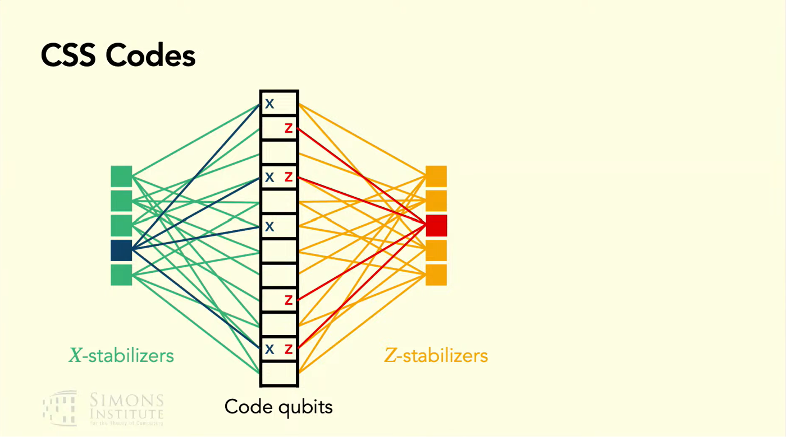
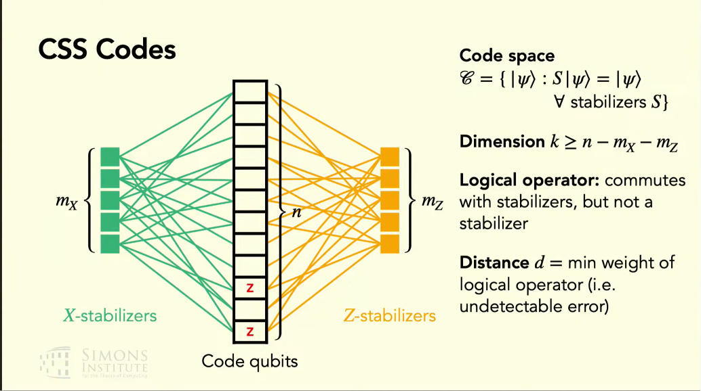
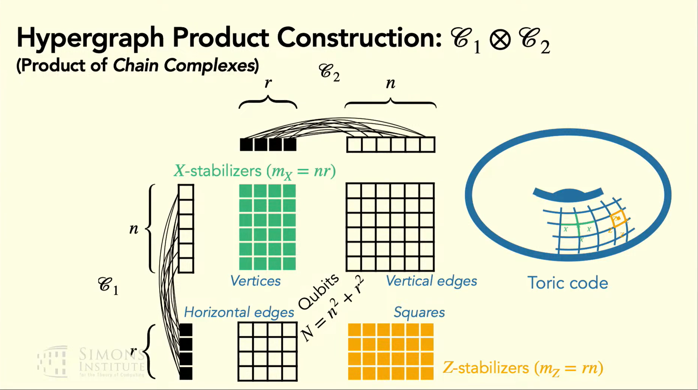
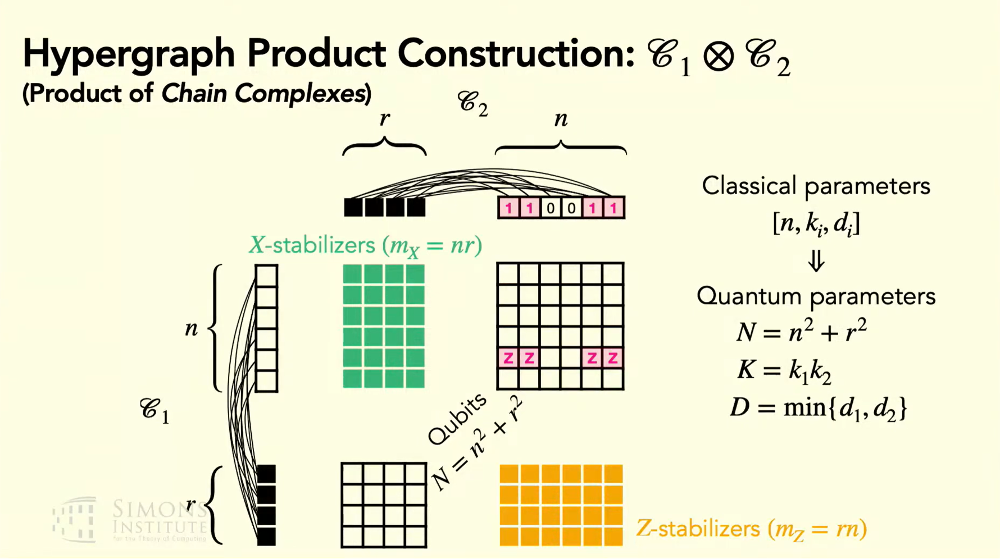
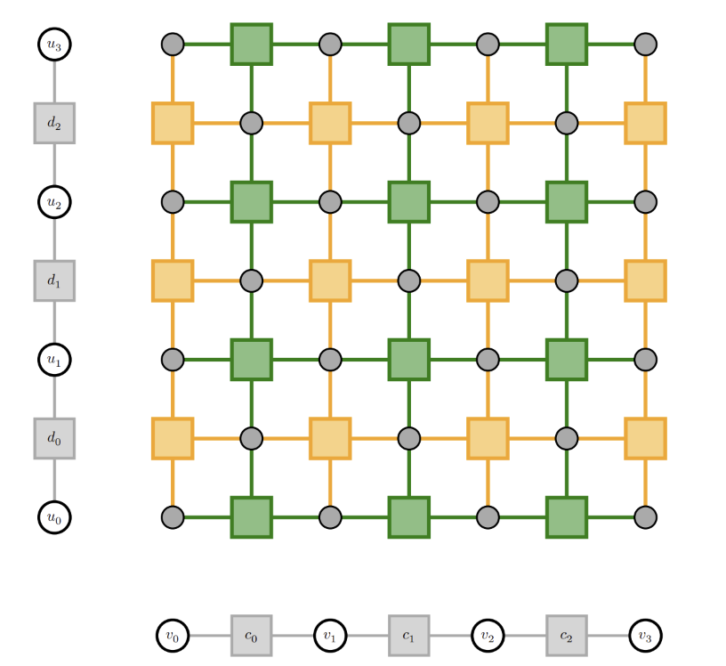

用于量子系统设计的几种常用的纠错码, 及相关性质.

从体系结构的角度，我们重点关注code的构造；对于code的性质，大多直接给出，不加证明，只求直观理解。

## From Stabilizer Code to CSS Code

**Def. (CSS Code)** 若某个stabilizer code, 其生成元要么都是$I$和$X$，要么都是$I$和$Z$, 则称其为CSS code.

**Remark.** CSS code是stabilizer code的子集.

**Remark.** Shor code和Steane code是CSS code. 而下图中的5-qubit code不是CSS code.

> [!NOTE]
>
> 这个5-qubit code是: **最小的**可以检测(detect) 并纠正 (correct) 任意单个比特上错误的code.

> [!NOTE]
>
> 生成元可以看作校验矩阵中的行，生成元构成的**稳定子群**（stabilizer group），就“校验”出来了码空间（code space）。

CSS code可以由两个对偶 (dual) 的classical error correction code来组成. (这是Gottesman讲义中引入CSS的方法, 但不直接) (实际上这是个定理, 下文详述)

我们为什么喜欢CSS code呢? 因其支持一些**横截门** (transversal gate).

**Def. (Transversal Gate, informal)** 若逻辑门$G_L$ = 对每个物理比特作相同的物理门$G$, 则称其为横截的.

**Remark.** 考虑硬件平台的特性 (如中性原子平台的原子移动等), 可能虽然满足不了上面的横截要求, 但其实也有类似的风格, 能够简化逻辑操作的实现. 稍稍放松上述定义, 或许可以去作一些探讨 (思路类似于近似算法).

下面考虑几种常用门在CSS code上的表现. 不详细证明.

**Prop.** 对所有的CSS code, CNOT都是横截的.

**Prop.** 若CSS code的$X$部分和$Z$部分是**对偶**的, 则Hadamard是横截的.

**Remark.** 此处的*对偶*可以直接认为是校验矩阵相等, 那么更直观地: 把所有$X$稳定子中的$X$替换成$Z$, 就是所有$Z$稳定子. Steane code即满足这一条定义.

**Remark.** 这一条性质由Hardmard门的性质导出, Hadamard做了这种交换.

**Prop.** 若CSS code是double even的，则Phase Gate是横截的. Double even指每个generator中$X$的数目和$Z$的数目均为4的倍数.

Steane Code满足上面的三条属性! 但是由于Gottesman-Knill定理, 我们知道Clifford电路是可以被多项式时间经典模拟的, 因而如果只是用这里的CNOT Hadamard和Phase Gate, 这个电路是可以被经典快速模拟的.

另一个好的想法是, 如果存在QECC, 其对应的横截门是**完备** (**universal**) 的 (如果只用Clifford, 则不完备), 那我们一定会在FTQC里用! 但是, 这个实现不了:

**Thm. (Eastin-Knill)** 对任意可以检测1-qubit错误的QECC, 由横截门生成的幺正变换集合是一个离散的集合 (discrete set), 因此, 不是完备的.

> [!NOTE]
>
> Eastin-Knill并没有否定"横截门可以被快速经典模拟" (Gottesman-Knill重视的). 其在说: 不能有连续的 (continuous) 横截门集合.

## Check Matrix & Tanner Graph

考虑$n$-bit的经典线性纠错码, 首先回顾校验矩阵的定义.

**Def. (Parity-Check Matrix)** $m \times n$矩阵$H$, 其第$i$行定义了一个奇偶校验.

能用校验矩阵写出来的, 自然是线性码 (Linear Code).

**Def. (Tanner Graph)** 记$H$的Tanner Graph为$\mathcal{G}_H$. 其包含$n$个比特节点, $m$个校验节点, 两组节点构成二分图. 当且仅当$H_{ij} = 1$, 比特$j$和校验$i$之间存在一条边.

可以简单理解成, **校验**和其在校验的**位**之间有边.

CSS code的"校验矩阵"是用两个经典的校验矩阵拼出来的 (当然, 需要引入 $(\cdot | \cdot)$的记号). 

现在考虑CSS code的Tanner Graph. 如图所示:

从二分图到了"三分图".

我们现在希望回顾一下"拼接"的可行性, 这个要求前面用"对偶"搪塞了. 其实, 拼接法相较CSS定义, 缺少的是"验证"其拼完之后是stabilizer code!

> [!NOTE]
>
> Stabilizer code的充要条件 (已默认在Pauli Group中讨论):
>
> 1. $-I \notin S$
> 2. $S$ 是群
> 3. $S$ 是Abel的
>
> 甚至有些讲义中直接将这个作为定义. 从"如何合理定义"的角度去思考, 可能还更方便, 参考[UCB讲义](https://people.eecs.berkeley.edu/~jswright/quantumcodingtheory24/scribe%20notes/lecture08.pdf)

实际上, 我们发现条件1和2已经满足, 我们只需满足条件3. 我们把用于拼接的两个校验矩阵记作$H_X$和$H_Z$, 则我们有
$$
H_XH_Z^{\top} \equiv 0 \ \text{mod} \ 2
$$
直觉: 如果同一个位置上有X和Z, 由于反对易性, 就会出来一个-1.

推知: 任何$X$校验和$Z$校验均共享偶数个qubit. 

## Go for Quantum LDPC

low density,即**稀疏**

定义"稀疏", 即定义了qLDPC code.

**Def.** **qLDPC code**是由"稀疏"的校验矩阵定义的stabilizer code. "稀疏"指满足如下两个条件: 1. 每个check作用于$O(1)$个qubit. 2. 每个qubit在$O(1)$个check中.

## Another Language: Chain Complex

尽可能少地引入链复形 (Chain Complex) 的语言, 以方便下文关于qLDPC的讨论.

考虑经典线性码. 考虑校验矩阵$H$. 其码字是$Hx = 0$约束出的向量, 即$\ker H$.

即有

$$
\underbrace{\mathbb{F}_2^n}_{\text{比特 (bits)}} \;\xrightarrow{\;H\;}\; \underbrace{\mathbb{F}_2^m}_{\text{校验 (checks)}}
$$

从链复形的角度看:
$$
C_1 \;\xrightarrow{\;\partial\;}\; C_0
$$

> [!TIP]
>
> 何故"重命名"? 笔者的两个想法:
>
> 1. 视角从"矩阵相乘"到"码相乘"
> 2. 理论上, 将其转换到流形上作研究

现在 (不正式地) 定义链复形:

**Def.** 链复形就是下面的链, 且满足$\partial_i \circ \partial_{i+1} = 0$.
$$
\cdots \to C_2 \xrightarrow{\partial_2} C_1 \xrightarrow{\partial_1} C_0 \to \cdots
$$

定义完了.

**Remark.**  $\partial_i \circ \partial_{i+1} = 0 \iff \text{Im} \partial_{i+1} = \ker \partial_i$

现在考虑如下的链: 
$$
C_2 \xrightarrow{\partial_2} C_1 \xrightarrow{\partial_1} C_0
$$

实际上, 给一个CSS code, 让$\partial_1$代表$H_X$, $\partial_2$代表$H_Z^{\top}$, 则这样构造出来的链满足定义条件.

之后, 每构造一个新的码, 只要我们希望去用链复形的语言, 就需要去验证上述性质. 换句话讲, 这个性质对于code也是重要的.

## HP Code

> HP = HGP = Hypergraph Product Code.
>

> 或许有帮助: [UC Berkeley关于Product Code的讲义](https://people.eecs.berkeley.edu/~jswright/quantumcodingtheory24/scribe%20notes/lecture15.pdf)
>

现在考虑有两个经典码, 我们用单步的复形来写出:

$$
A_\bullet:\quad A_1 \xrightarrow{\partial_A} A_0, \qquad B_\bullet:\quad B_1 \xrightarrow{\partial_B} B_0
$$

类比多项式乘法 (不严谨, 但先乘了再说; 你也可以说是Leibniz Rule得出来的, 或许你是对的),  得到下表

| **阶数 (Degree)** | **组成部分 (Pieces)**                        |
| ----------------- | -------------------------------------------- |
| **2**             | $A_1 \otimes B_1$                            |
| **1**             | $(A_1 \otimes B_0) \oplus (A_0 \otimes B_1)$ |
| **0**             | $A_0 \otimes B_0$                            |

这可以写成链:

$$
A_1\!\otimes\! B_1 \;\xrightarrow{\;\partial_2\;}\; (A_1\!\otimes\! B_0)\oplus(A_0\!\otimes\! B_1) \;\xrightarrow{\;\partial_1\;}\; A_0\!\otimes\! B_0
$$

如下的边界 (Boundary) 算子可以写成如下形式:
$$
\partial_2 \;=\; \begin{bmatrix} I\otimes\partial_B \\[2pt] \partial_A\otimes I \end{bmatrix}, \qquad \partial_1 \;=\; \begin{bmatrix}\,\partial_A\otimes I \ \ \big|\ \ I\otimes\partial_B\,\end{bmatrix}.
$$
验算条件:
$$
\partial_1\partial_2 \;=\; (\partial_A\!\otimes\! I)(I\!\otimes\!\partial_B) + (I\!\otimes\!\partial_B)(\partial_A\!\otimes\! I) \;=\; (\partial_A\!\otimes\!\partial_B) + (\partial_A\!\otimes\!\partial_B) \;=\; 0 \pmod 2.
$$
知其为链复形.

> [!TIP]
>
> 为什么可以分块?
>
> 带直和 (direct sum) 的线性映射:
>
>
> -  $X \to Y_1 \oplus Y_2$ 是 $X \to Y_1$ 和 $X \to Y_2$的组合. 纵向分块:
>   $$
    \begin{pmatrix} y_1 \\ y_2 \end{pmatrix} \;=\; \begin{bmatrix} M_1 \\ M_2 \end{bmatrix} x.
    $$
> - $X_1 \oplus X_2 \to Y$ 是 $X_1 \to Y$ 和 $X_2 \to Y$ 的组合, 横向分块: 
>   $$
    y \;=\; \begin{bmatrix} M_1 \ \big|\ M_2 \end{bmatrix} \begin{pmatrix} x_1 \\ x_2 \end{pmatrix} \;=\; M_1 x_1 + M_2 x_2.
    $$
>

当然, 如果只是讨论HP code, 也可以不引入链复形直接看矩阵. 往回换, 只需找到对应: $\partial_1 \sim H_X$, $\partial_2 \sim H_Z^{\top}$, $\partial_A \sim H_A$, $\partial_B \sim H_B^{T}$ , 则有
$$
\boxed{\;H_X \;=\; \partial_1 \;=\; \big[\,H_A \otimes I_{n_B} \ \;\big|\;\ I_{m_A} \otimes H_B^{\top}\,\big]\;}\qquad m_A n_B \times (n_A n_B + m_A m_B),
$$

$$
\boxed{\;H_Z \;=\; \partial_2^{\top} \;=\; \big[\,I_{n_A} \otimes H_B \ \;\big|\;\ H_A^{\top} \otimes I_{m_B}\,\big]\;}\qquad n_A m_B \times (n_A n_B + m_A m_B).
$$

此处令$\partial_B \sim H_B^{T}$, 可以认为是把Tanner Graph倒过来, 以求校验 $\rightarrow$ 比特 $\rightarrow$ 校验的自然流向.

$H_XH_Z^{\top} \equiv 0$容易检验, 不再证.

这个时候, 有必要回顾一下, 为什么要搞出这样一个Code呢? 

因为在此之前, 对code的研究聚焦于二维拓扑量子码 (2D topological quantum code), 其parity check是geometrically local的, 即其校验仅作用于空间上有限的邻域 (finite spatial neighborhood). 其**码距**极受限. Bravyi-Poulin-Terhal (BPT) bound指出了这一点:

**Thm. (BPT Bound)** 对任意 $[[n, k, d]]$ 二维拓扑量子码,  有$kd^2 \leq O(n)$. 

推知$d \leq O(\sqrt{n})$. 并且, 如果希望码能够容纳更多逻辑比特 (增加$k$), 则$d$很有可能需要减小.

为克服BPT bound, 接近线性的码距 (linear distance), 必须抛弃严格的二维局域校验. 

HP code是第一个从这些角度克服BPT bound的code, 其本身也可以视为toric code的推广.

## GB Code

> GB = Generalized Bicycle
>

直接介绍构造. 仍然考虑两个码, 但是不再直接作两个码的张量积, 而是将其校验矩阵拼接:
$$
H_X = [\,A \mid B\,], \qquad H_Z = [\,B^{\top} \mid A^{\top}\,].
$$
如果其能满足$H_X H_Z^{\top} \equiv 0 \pmod 2$, 那么这个码就是CSS code.

展开得
$$
H_X H_Z^{\top} = [\,A \mid B\,]\begin{bmatrix} B \\ A \end{bmatrix} = AB + BA \equiv 0 \pmod 2
$$
这也即在$\mathbb{F}_2$上满足$AB = BA$即可.

一个可以满足对易性的常用好东西是循环 (轮换) 矩阵!

比如$l \times l$矩阵$S$:
$$
S = \begin{bmatrix}  0 & 1 & 0 & \cdots & 0 \\ 0 & 0 & 1 & \cdots & 0 \\ \vdots & \vdots & \vdots & \ddots & \vdots \\ 0 & 0 & 0 & \cdots & 1 \\ 1 & 0 & 0 & \cdots & 0  \end{bmatrix}
$$
自然有$S^l = I$. 将其作为"生成元", 可以带入到多项式中: $a(x) = \sum_i a_i x^i \ \to \ A = \sum_i a_i S^i$ .

实际上, 这些矩阵构成了一个交换环, 其同构于
$$
R = \mathbb{F}_2[x]\,/\,(x^{\ell} - 1).
$$
注意: $(x^l - 1)$ 为 $x^l - 1$ 生成的主理想.

这个关于商环的观察是重要的, 因为其与BB code所同构的商环比较, 即立刻知二者区别.

回过头来构造GB code. 选定长度$l$和两个多项式$a(x), b(x) \in R$, 将循环矩阵$S$代入即可得$A, B$. 

> [!NOTE]
> 
> 双块布局使得对易性水到渠成. 不再需要费力寻找"对偶"的经典码.

**Why LDPC?**  观察$A, B$, 其矩阵内部**每一行** (校验) 的非零元数目是相同的, 即$w_a, w_b$. 保持$w_a, w_b$为常数, 即每个check对应$O(1)$个qubit. **列同理**. 则每个qubit对应$O(1)$个check.

**参数.** 该码使用 $n = 2\ell$ 个量子比特, 并编码了
$$
k = 2 \deg \gcd\!\big(a(x),\, b(x),\, x^{\ell} - 1\big)
$$
个逻辑量子比特 (gcd 在 $\mathbb{F}_2$ 上计算). 距离通常需要通过数值方法求解. 不作证明. 参考: https://arxiv.org/pdf/1904.02703

> [!NOTE]
> 
> $H_X$ 的各行可以不是线性独立的——也即退化 (degenerate) 的, 包含冗余的生成元. 这在校验矩阵中是允许的; 真正决定逻辑比特数的是独立生成元的数量, 即 $k = 2\ell - \mathrm{rank}(H_X) - \mathrm{rank}(H_Z)$.

## BB Code

> BB = Bivariate Bicycle = 双元自行车码
>

BB code使用了两个循环变量, 将一元环替换为
$$
R = \mathbb{F}_2[x, y]\,/\,(x^{\ell} - 1,\; y^{m} - 1).
$$
采用$$x = S_{\ell} \otimes I_{m}, \ y = I_{\ell} \otimes S_{m}.$$ $S$是同上的循环矩阵, 只是矩阵维数有变.

其满足$xy = yx$. (这是显然的, 但是如果$x$, $y$不这样平凡地取, 会有影响吗?)

推知$R$仍然是交换环.

考虑构造, 同上.
$$
H_X = [\,A \mid B\,], \qquad H_Z = [\,B^{\top} \mid A^{\top}\,].
$$
其中$A = a(x, y), B = b(x, y)$. $a(x,y), b(x, y)$是多项式. 

$H_X H_Z^{\top} \equiv 0 \pmod 2$ 同上, 易证.

**参数.** $A, B$均为$lm \times lm$的矩阵. 则物理比特数$n = 2lm$.

> [!NOTE]
> 
> 对于stabilizer code, 其自然有$n = k - \text{rank}(H)$. 由于CSS code由两部分拼成, 则推知其有$n = k - \text{rank}({H_X}) - \text{rank}(H_Z)$. 且不论复杂度, $\text{rank}$至少有高斯消元法支持求出.

**$\mathbb{Z}_{\ell} \times \mathbb{Z}_{m}$ 在什么情况下同构于 $\mathbb{Z}_{\ell \cdot m}$**?

当且仅当$\gcd(\ell, m) = 1$. 这是中国剩余定理!

> [!NOTE]
>
> 借这个机会, 理解一下中国剩余定理 (Chinese Remainder Theorem, CRT). 其往往在环论背景下考察. 设 $N = n_1 \cdots n_k$, 其中 $n_1 \cdots n_k \in \mathbb{Z}_{\geq 1}$ 两两互素, 则有环同构:
> $$
> \mathbb{Z}_{N} \cong \mathbb{Z}_{n_1} \times \mathbb{Z}_{n_2} \times \dots \times \mathbb{Z}_{n_k}
> $$
> 此处的$\mathbb{Z}_{n_i}$亦可记为$\mathbb{Z} / n_i \mathbb{Z}$.  $\mathbb{Z}_N$同理.
>
> 推广到主理想环上.设 $R$ 为主理想环，$a_1, \dots, a_n \in R \setminus \{0\}$ 两两互素，$a := a_1 \cdots a_n$，则有环同构:
> $$
> \varphi : R/(a) \longrightarrow \prod_{i=1}^n R/(a_i)
> $$
>
> $$
> r + (a) \longmapsto (r + (a_i))_{i=1}^n.
> $$
>
> 不作证明. 证明可见李文威代数学讲义. 若从算法角度切入, 则先证明$n = 2$情形, 之后递归即可.
>
> 环论上成立, 那么把环里面的加法群拿出来, 自然也是成立的. 对于本文对code的阐述, 诸如$Z_{\ell}$的循环是加法群.  

### IBM: Gross Code

取$l = 12, m = 6, A = x^3 + y + y^2, B = y^3 + x + x^2$, 则得到了$[[144, 12, 12]]$ 的BB code.

每个块贡献了3个单项式, 则校验的weight是6, 且每个qubit对应6个校验. 其确为qLDPC code.

调整$l, m$, 还可以得到$[[72,12,6]]$ , $[[288,12,18]]$等code.

**硬件适配.** TODO. 接下来重点看.

### Summary: Two Branches

问题: HP code和BB code中都有张量积. 其可以被归为一种构造吗?

不能.

HP code中, 张量积用于经典码的相乘.

BB code中, 张量积用于构建"二维环面".

将其视为Toric code的推广, 考虑两种方式.

*HP code*. 将两个最基本的repetition code作张量积, 可得

如果这两个repetition code首位相接, 呈循环, 则tensor之后即正好在torus上面.

*BB code*. 直觉简单: 环面上的点是$\mathbb{Z}_\ell\times\mathbb{Z}_m$.

考虑$x = S_\ell\otimes I_m$，$y = I_\ell\otimes S_m, A = 1 + x, B = 1 + y$. 那么, 这个是local的.

## 2BGA Code

> 2BGA = Two-Block Group Algebra

***说文.*** Two-Block结构在GB code、BB code中已经见到, 此处沿用. 而Group Algebra, 即群代数, 是新工具, 对其作介绍.

***群代数.*** 令$G$为群, $R$为环. 此时$R[G]$是如下元素的集合:
$$
a = \sum_{g \in G} r_g\, g, \qquad r_g \in R.
$$
将$R[G]$称为**群环**. 若$R$交换, 则称$R[G]$为**群代数**.

加法、乘法是自然的, 如你所想. 乘法满足$\big(\sum a_g g\big)\big(\sum b_h h\big) = \sum_{g,h} a_g b_h\,(gh)$, 双线性.

可证$R[G]$是环.

重要观察: $R$交换推不出$R[G]$交换. 群代数$R[G]$可交换 $\iff$ $G$可交换.

如果您不喜欢环论, 也不用担心, 因为实际上, 构造code常常用的是简单而具体的数学对象, 大多数读者对此是熟悉的.

***群代数观点看BB/GB Code.*** 取$R = \mathbb{F}_2$. 

- $G = \mathbb{Z}_{\ell}$ ：$\mathbb{F}_2[\mathbb{Z}_{\ell}] \cong \mathbb{F}_2[x]/(x^{\ell} - 1)$ —— GB Code
- $G = \mathbb{Z}_{\ell} \times \mathbb{Z}_{m}$：$\cong \mathbb{F}_2[x, y]/(x^{\ell}-1,\, y^{m}-1)$ —— BB code
- $G = \cdots$

***动机.*** 如果$G$选取其他群?  

<u>*如果是Abel群?*</u>

对于有限Abel群, 其总是可以分解为若干个循环群的直积. 则其对应了$k$元的多项式环, 也即$k$元的自行车码. 对于$G = \mathbb{Z}_{n_1} \times \dots \times \mathbb{Z}_{n_k}$, 其对应$\mathbb{F}_2[x_1, \dots, x_k] / (x_1^{n_1}-1, \dots, x_k^{n_k}-1)$. 这可以是一个延伸方向,但不是2BGA所重点选取的.

> 个人认为, 由于中国剩余定理, 不管用几个变元, 其总是多多少少有同构, 实质上没有特别不同. (真的吗?)
>
> 那么选取多个变元, 可能更多的是在硬件特性, 比如"几何排布"上, 有不同的考量.

<u>*如果不是Abel群?*</u>

比如稍稍延伸一些, 到简单的非交换群, 如二面体群、四元数群?

那么$\mathbb{F}_2[G]$也是非交换的, 2BGA即于此开始探究.

***正则表示.*** 现在, 从抽象的代数结构中回过神来. 为了落到实际的硬件上, 我们需要校验矩阵. 自然地, 我们需要将抽象元素用矩阵**表示**出来. 

设群$G = \{g_1,\dots, g_n\}$. 向量空间 $V$ 的基为 $\{e_{g_1}, e_{g_2}, \dots, e_{g_n}\}$, $\dim V = n$.

$\forall a \in G$, 其**左正则表示**定义为一个线性映射, 规则为
$$
L(a) e_{g_i} = e_{a g_i}
$$
$L(a)$ 是一个 $n \times n$ 的方阵.

如果 $a \cdot g_i = g_k$, 那么这个矩阵第 $i$ 列的第 $k$ 个位置就是 1, 其余位置都是 0. 以此法, $L(a)$ 的矩阵表示即被构造出.

同理可以定义**右正则表示**: 
$$
e_{g_i} R(a) = e_{g_i a}.
$$

> 个人理解: 可以认为此处的$\{e_{g_1}, e_{g_2}, \dots, e_{g_n}\}$同构于$\{e_{1}, e_{2}, \dots, e_{n}\}$. 取群元$g_i$的编号$i$即可. 也可以说, 这个矩阵$L(a)$、$R(a)$ 选的基底就是$\{e_{g_1}, e_{g_2}, \dots, e_{g_n}\}$. 

<u>*重要观察:*</u> 在正则表示中, 群里的**每一个元素**都被映射成了**一个$n \times n$的置换矩阵**.

<u>*复习*:</u> GB code中, 群$\mathbb{Z}_{\ell}$中的元素$i$被映射到了$x^i = S^i$. BB code中, 群$\mathbb{Z}_{\ell} \times \mathbb{Z}_m$中的元素$(i, j)$被映射到了$x^i y^j = S_{\ell}^i \otimes S_{m}^j$.

最后, $H_X H_Z^{\top} \equiv 0$条件中有矩阵的转置操作. 由置换矩阵的逆等于其转置，若矩阵$A$对应$a = \sum a_g g$, 则$A^{\top}$对应$\bar{a} = \sum a_g g^{-1}$. 

***从正则表示到CSS条件.*** 我们仍然希望满足$H_X H_Z^{\top} \equiv 0$条件. 沿用双块构造：
$$
H_X = [\,A \mid B\,], \qquad H_Z = [\,B^{\top} \mid A^{\top}\,].
$$
则需要仍满足$AB = BA$.

此处利用: 左、右正则表示有**交换性**! 考虑 $\forall a, b \in \mathbb{F}_2[G], \forall v \in V$,
$$
L(a)R(b)v = a(vb) = (av)b = R(b)L(a)v,
$$
也即
$$
\boxed{\,L(a)\, R(b) \;=\; R(b)\, L(a)\,}
$$
正则表示的**交换性**由线性映射的**结合律**直接导出。

> Ref: Lin, Hsiang-Ku, and Leonid P. Pryadko. “Quantum Two-Block Group Algebra Codes.” arXiv:2306.16400. Preprint, arXiv, June 28, 2023. https://doi.org/10.48550/arXiv.2306.16400. 
>
> 以上介绍遵循这篇原始文献. 不过, 我认为, 也有一种"比较平凡"的满足CSS条件的方式, 比如直接取$a, b \in \mathbb{F}_2[G]$, $ab = ba$. 这样像是在利用"非交换群"中的"局部交换性". 效果如何? 我没有去进一步考证, 之后去看看. 

***构造.*** 对于有限群$G$, $|G| = \ell$, **任取**$a, b \in \mathbb{F}_2[G]$, 令$A = L(a), B = R(b)$, 则$\text{2BGA}(a,b)$如下构造:
$$
H_X = [\,A \mid B\,] = [\,L(a) \mid R(b)\,], \qquad H_Z = [\,B^{\top} \mid A^{\top}\,] = [\,R(\bar b) \mid L(\bar a)\,],
$$
**注意: $a, b$不需要对易.**

$H_X H_Z^{\top} \equiv 0$易证.

***参数.*** $n = 2 \ell$. $k, d$ 无直接表达式, 仍然通过通用方法求解. (未深入研究, 需要进一步确认).

***LDPC性质.*** 考察$H_X$, 其行、列的weight即为 ($a$的项数 + $b$的项数). $H_Z$同理. 保持$a, b$ sparse即可.

## Thoughts

将code放到网络上?

code的三角

## Ref

[Introduction to Quantum Information Science II](https://www.scottaaronson.com/qisii.pdf) by Scott Aaronson

https://www.youtube.com/watch?v=MqGBwQjS4CI&list=PLgKuh-lKre11aM00IH-iPtNoLh9Q9O03t Simons Institute组织的讨论

https://people.eecs.berkeley.edu/~jswright/quantumcodingtheory24/scribe%20notes/lecture08.pdf Stabilizer Code充要条件参考

https://people.eecs.berkeley.edu/~jswright/quantumcodingtheory24/scribe%20notes/lecture15.pdf Product Code
